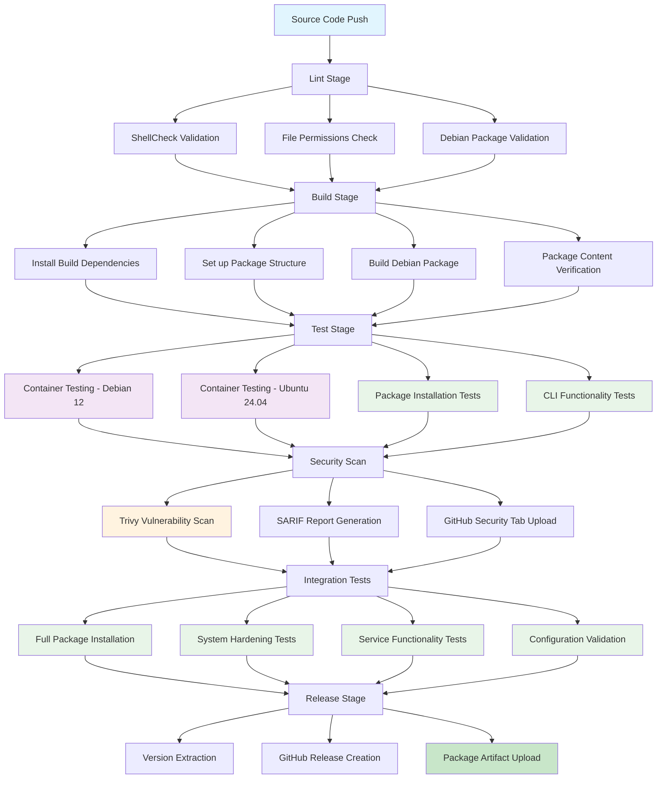
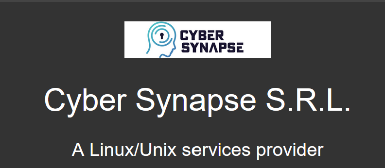

# HARDN-XDR

[](https://github.com/OpenSource-For-Freedom/HARDN-XDR/actions/workflows/validate.yml)

<p align="center">
  
</p>

**A Linux Security Project for Debian Systems**


## Overview

HARDN-XDR is an endpoint security and hardening solution for Debian-based systems that provides:

- **System Hardening**: Comprehensive security hardening following STIG compliance guidelines
- **Endpoint Management**: Advanced monitoring, securing, and maintenance of network devices
- **STIG Compliance**: Alignment with [Security Technical Information Guides](https://public.cyber.mil/stigs/) from the [DOD Cyber Exchange](https://public.cyber.mil/)
- **Automated Security**: Real-time threat detection and response capabilities

## Features

- **Comprehensive Monitoring**: Real-time insights into endpoint performance and security status
- **Enhanced Security**: Advanced security protocols and hardening measures
- **Scalability**: Supports small to large-scale network deployments  
- **STIG Compliance**: Government-grade security for Debian-based information systems
- **Modular Architecture**: Professional CLI interface with specialized security modules
- **GTK Dashboard**: Native GUI dashboard for monitoring and management
- **REST API**: HTTP API for integration and remote monitoring


## Installation

### Requirements

- **Debian 12** or **Ubuntu 24.04** (bare-metal or virtual machines)
- Root or sudo access for installation
- Internet connection for package downloads

### Installation Methods

#### 1. Debian Package (Recommended)

Download and install the latest .deb package:

```bash
# Download the latest release
wget https://github.com/OpenSource-For-Freedom/HARDN/releases/latest/download/hardn-xdr_2.0.0-1_all.deb

# Install the package
sudo dpkg -i hardn-xdr_2.0.0-1_all.deb

# Fix any dependency issues
sudo apt-get install -f
```

#### 2. Build from Source

```bash
git clone https://github.com/OpenSource-For-Freedom/HARDN.git
cd HARDN
dpkg-buildpackage -us -uc -b
sudo dpkg -i ../hardn-xdr_*.deb
```

### What Gets Installed

- Security-focused package collection
- System hardening and STIG compliance settings  
- Malware detection and signature-based response system
- Comprehensive monitoring and reporting tools
- Native `.deb` package with proper dependency management
- Systemd service integration
- FHS-compliant directory structure

For detailed information, see [HARDN.md](docs/HARDN.md) and [deb_stig.md](docs/deb_stig.md).

## Architecture

HARDN-XDR v2.0.0 follows a modular architecture with proper Linux filesystem hierarchy compliance:

### Installation Structure
```
/usr/bin/hardn                    # Main executable
/usr/share/hardn/modules/         # Security modules
/usr/share/hardn/templates/       # Configuration templates  
/usr/share/man/man1/hardn.1       # Manual page
/etc/hardn/hardn.conf             # System configuration
/var/log/hardn/                   # Application logs
/var/lib/hardn/                   # Application data
/lib/systemd/system/             
```

### Core Modules
- **logging.sh** - Centralized logging with rotation
- **utils.sh** - Common utilities and system checks
- **hardening.sh** - Core security hardening and STIG implementation
- **audit.sh** - Security scanning and compliance checking
- **status.sh** - System monitoring and performance metrics
- **backup.sh** - Configuration backup and restore
- **monitor.sh** - Service management and real-time monitoring
- **update.sh** - Security updates and signature maintenance
- **uninstall.sh** - Clean removal and system restoration

### Source Repository Structure
```
HARDN-XDR/
├── docs/                        
│   ├── assets/                  
│   ├── CODE_OF_CONDUCT.md       
│   ├── HARDN.md                  
│   ├── deb_stig.md               
│   └── refactoring-summary.md    
├── debian/                       
├── src/                         
├── systemd/                     
├── usr/                          
├── install.sh                   
└── README.md                    
```

## Build Process

> **For detailed build documentation, see [docs/build-process.md](docs/build-process.md)**  
> **Quick Answer**: Docker files are NOT needed for dpkg build - they're only used for testing.

HARDN-XDR uses a CI/CD pipeline with testing and quality assurance:



### Build Stages Explained

1. **Lint Stage**: Code quality validation using ShellCheck, file permission verification, and Debian packaging structure validation
2. **Build Stage**: Debian package compilation with proper dependency management and FHS compliance
3. **Test Stage**: Multi-distribution testing in containerized environments (Debian 12, Ubuntu 24.04)
4. **Security Scan**: Vulnerability assessment using Trivy with automated security reporting
5. **Integration Tests**: End-to-end functionality testing with real system installation
6. **Release Stage**: Automated GitHub releases with versioned artifacts for production deployment

## Usage

### Command Line Interface

```bash
# System hardening
sudo hardn setup

# Check system status  
hardn status

# Run security audit
hardn audit

# Monitor services
hardn monitor start
```

### GUI Dashboard

Launch the native GTK dashboard for graphical monitoring and management:

```bash
# Basic launch
hardn dashboard

# Launch with full privileges (recommended for service control)
sudo hardn dashboard

# Direct execution
hardn-dashboard
```

#### Dashboard Features

**Real-time Monitoring:**
- **System Metrics**: Live graphs showing CPU, memory, disk, and network usage
- **Security Services**: Status monitoring for UFW, Fail2Ban, AppArmor, ClamAV, SSH, and more  
- **Kernel Parameters**: Display of critical security-related sysctl values
- **System Information**: Hostname, uptime, and load average

**Security Management:**
- **Service Control**: Enable/disable security services with graphical buttons
- **Live Logs**: Real-time viewing of authentication and security logs
- **Status Dashboard**: Comprehensive overview of system hardening status

**Interface Layout:**
- **Left Panel**: Security services list, control buttons, and kernel parameters
- **Right Panel**: Real-time system metrics graphs and security log viewer
- **Header**: System information and status bar with operation feedback

**Design**: Professional dark theme with Debian-inspired color scheme (slate grey, black, and red) optimized for extended monitoring sessions.

#### Prerequisites

The GUI dashboard requires a desktop environment and additional Python packages:

```bash
sudo apt install python3-gi python3-gi-cairo python3-matplotlib python3-psutil python3-requests gir1.2-gtk-3.0
```

These dependencies are automatically installed when using the standard HARDN-XDR installation methods.

### REST API

Start the HTTP API server for remote monitoring and integration:

```bash
# Start API server on localhost:8080
hardn api

# Start on custom port with full privileges
sudo hardn api --port 9090 --host 0.0.0.0
```

API endpoints:
- `GET /api/status` - System status information
- `GET /api/services` - Security services status
- `GET /api/metrics` - Live system metrics
- `GET /api/logs` - Security logs
- `POST /api/service` - Control services

## License

This project is licensed under the MIT License.

## Contact

For questions or support, contact: office@cybersynapse.ro

## Project Partners

<p align="center">
  
</p>
